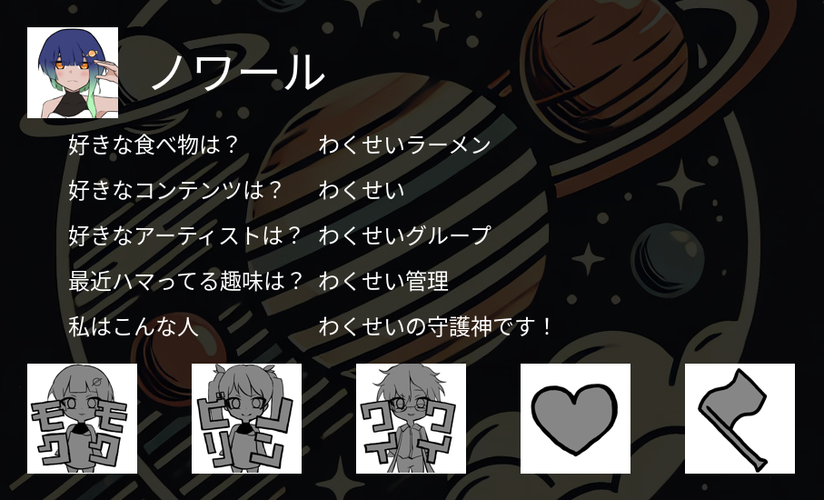

# わくせいメイシシステム(WMS)

## Discordサーバー「わくせい」のメイシ管理BOT

*iilust by yukinoshita*

## 機能
- add_cardコマンドによるメイシの質問に対する答えを追加する機能
- 追加した答えをユーザーのアイコン、名前とともにメイシにプリントする機能
- 作成したメイシをユーザーがボイスチャットに接続した際にボイス内のテキストチャンネルに投稿する機能
- VCチャンネル作成部屋にログインしたユーザーに対して専用の部屋を作成し、移動させる機能
- room_nameコマンドにより自身で作成した部屋に任意の名前を付ける機能
- room_limitコマンドにより自身で作成した部屋の人数制限を任意の値に変更する機能