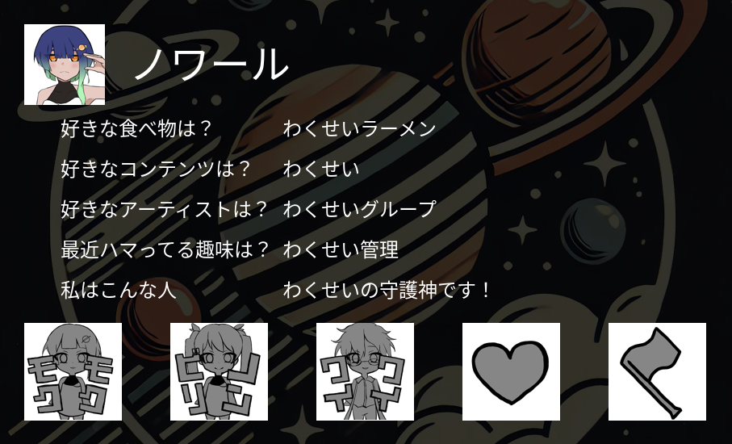

# わくせいメイシシステム(WMS)

## Discordサーバー「わくせい」のメイシ管理BOT

*iilust by yukinoshita*

## 機能
- add_cardコマンドによるメイシの質問に対する答えを追加する機能
- 追加した答えをユーザーのアイコン、名前とともにメイシにプリントする機能
- 作成したメイシをユーザーがボイスチャットに接続した際に特定のテキストチャンネルに投稿する機能
- 特定のテキストチャンネルが閲覧できるように専用ロールを付与/削除する機能